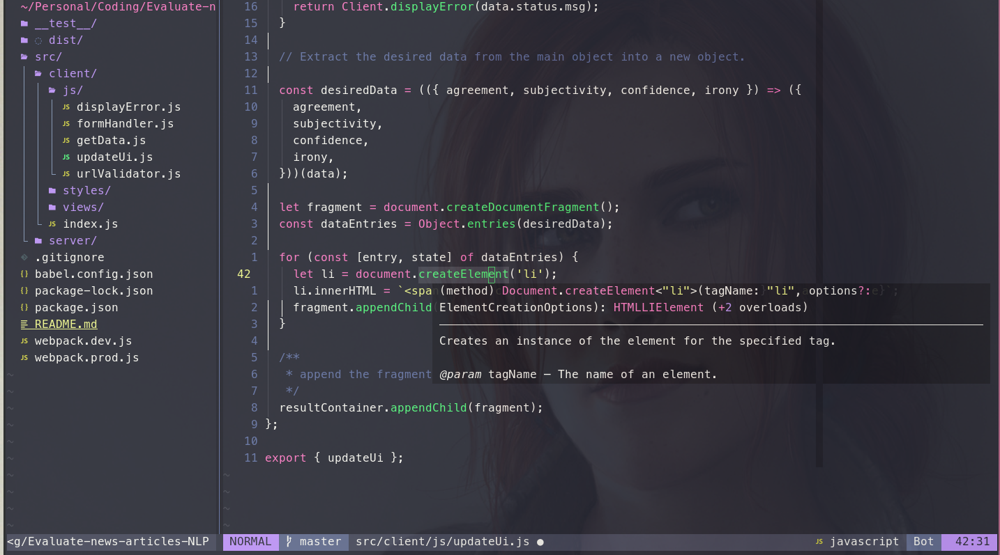
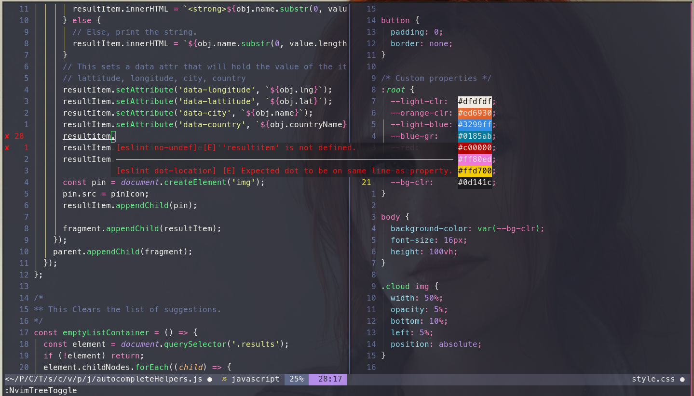

## A somewhat sober Neovim configuration

### Powered by [coc](https://github.com/neoclide/coc.nvim) and geared toward Front-End development




---

## Features

* Typescript/Javascript Integration.
* Tmux friendly.
* Git Integration.
* Line indentation.
* Treesitter highlighting.
* Auto completion.
* Auto pairs closing.
* File explorer.
* Color codes highlights.
* Intuitive navigation.
* Smooth scrolling.
* Mouse support.
* Show code coverage if available.
* Smart autocomplet.
* Tweeks for easier navigation.
* Configured for web development.
* Format on save, eslint support ...


## Color Scheme

I frequently change my colorscheme. For that I have a `themes/` directory holding the configuration files for every colorscheme, that way I can source them in a `theme.vim` file that maintains general configuration.

    ├── config        
    │   ├── theme.vim
    │   ├── themes/
    │   │   ├── gruvbox8.vim
    │   │   ├── dracula.vim
    │   │   │...
    │

To switch to a different colorscheme just change the {name}.

From `dracula dark`:

###### **`config/theme.vim`**
```vim
" Load the colorscheme
colorscheme dracula
" Dark mode
set background=dark
```

To `gruvbox8 light`:
###### **`config/theme.vim`**
```vim
" Load the colorscheme
colorscheme gruvbox8
" Dark mode
set background=light
```

The two that I use the most are [gruvbox8](https://github.com/lifepillar/vim-gruvbox8) and [dracula](https://github.com/dracula/vim) mainly because I can use them everywhere(tmux, urxvt, etc). moonlight, ayu and solarized8 can also be selected.

### Shortcuts and Hotkeys

#### Splits and Windows

|Command | Action|
|--- | --- |
| `leader+direction`| Move between splits (_eg: `leader h` moves to left split_)|
| `leader fh`| Set window height to full height|
| `leader fw`| Set window width to full width|
| `alt+l` and `alt+h`| Resize width|
| `alt+j` and `alt+k`| Resize height|
| `ctrl+p`| Open file explorer|

#### File explorer

|Command | Action|
|--- | --- |
| `ctrl+n`| Open file explorer|
| `leader n`| Find current opened file in file explorer|
| `d`| Delete file|
| `r`| Rename file|
| `o`| Open file|
| `a`| Add file|
| `g?`| Open file explorer help menu|

#### Editing

|Command | Action|
|--- | --- |
| `jj`| Escape in normal mode|
| `>`| Tab to right without escape in visual mode|
| `<`| Tab to right without escape in visual mode|
| `alt+o`| New line below the selected line and stay in **normal** mode|
| `alt+o`| New line over the selected line and stay in **normal** mode|
| `o`| New line below and enter **insert** mode|
| `O`| New line over and enter **insert** mode|
| `vw`| Select word under cursor|
| `cw`| Change word under cursor|
| `leader /`| Comment selected line|
| `ysiw`| Surround word under cursor|
| `cs`| Change surround (_eg: `cs'"` will change `'foo'` to `"foo"`_)|
| `ds`| Delete surround|

---

##### Future plans

* Add and installation script.
* Full list of hotkeys.
* List of plugins and alternatives.
* Custumization (How to add plugins, color configuration etc).
* Migrate to lua.
* lsp instead of coc(I don't see a solid reason to make the switch right now.)

